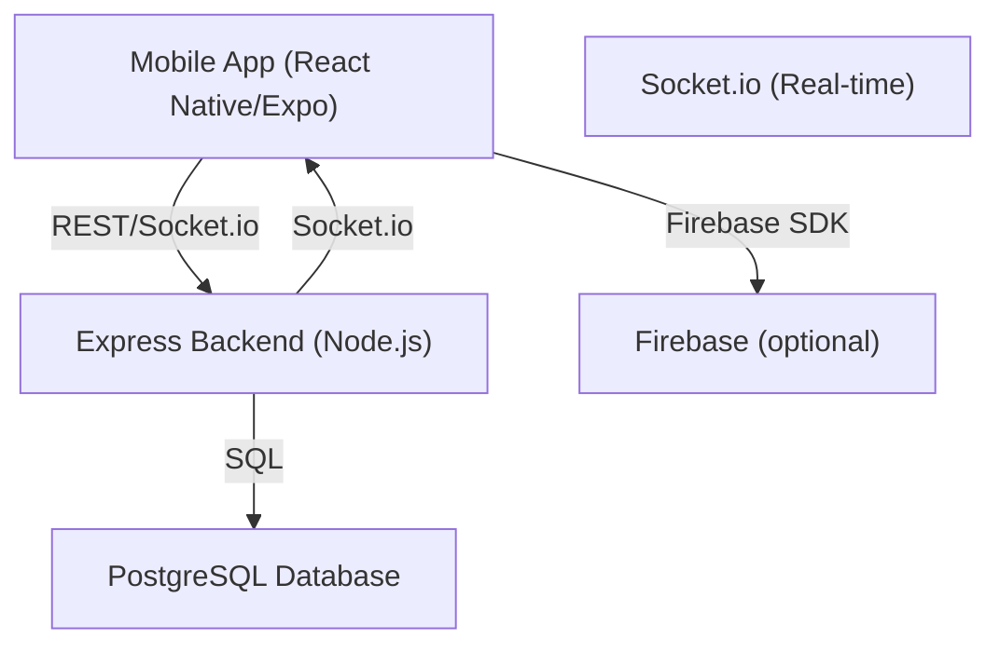

# Project Setup Guide

## Project Overview

This project consists of:
- **frontend/**: React Native (Expo) mobile app
- **my-api/**: Node.js/Express backend API
- **PostgreSQL**: Database (with triggers for location history)
- **Real-time**: Uses socket.io for live updates
- **Expo Sensors**: For device heading (compass)
- **Firebase**: (Optional) for notifications/auth

---

## Architecture Diagram



---

## Step-by-Step Setup Instructions

### 1. Prerequisites

- **Node.js** (v16+ recommended)
- **npm** (comes with Node.js) or **yarn**
- **PostgreSQL** (know your username, password, and port)
- **Git** (to clone the repo)
- **Expo CLI** (for React Native app)
- **Android Studio/Xcode** (for emulators, or use a physical device)
- **(Optional) Firebase account** (if using notifications/auth)

---

### 2. Clone the Repository

```sh
git clone <your-repo-url>
cd <your-repo-folder>
```

---

### 3. Set Up the Backend (API)

```sh
cd my-api
```

#### a. Install dependencies
```sh
   npm install
   ```

#### b. Configure Environment Variables
- Create a `.env` file in `my-api/` with:
  ```
  PGHOST=localhost
  PGUSER=your_db_user
  PGPASSWORD=your_db_password
  PGDATABASE=your_db_name
  PGPORT=5433
  PORT=3001
  ```
- Replace values as needed.

#### c. Set Up the Database
- Ensure PostgreSQL is running.
- Create the database and tables (run provided SQL scripts if any).
- Make sure triggers for location history are set up if needed.

#### d. Start the Backend
```sh
node index.js
```
- The server should say: `Server running on http://localhost:3001`

---

### 4. Set Up the Frontend (Mobile App)

```sh
cd ../frontend
```

#### a. Install dependencies
```sh
npm install
```

#### b. Install Expo CLI (if not already)
```sh
npm install -g expo-cli
```

#### c. Install Expo Sensors
```sh
expo install expo-sensors
```

#### d. Update Expo to the Required Version
```sh
npm install expo@53.0.20
```

#### e. Configure API URL
- In `frontend/services/api.js`, set `API_BASE_URL` to your computer’s local IP (not `localhost`), e.g.:
  ```js
  const API_BASE_URL = 'http://192.168.1.100:3001/api';
  ```
- Make sure your phone/emulator is on the same WiFi network.

#### f. Start the App
```sh
expo start
```
- Scan the QR code with your phone (Expo Go app) or run on an emulator.

---

### 5. (Optional) Set Up Firebase

- If using Firebase, follow the instructions in `frontend/firebase-config.js` and add your Firebase project credentials.

---

### 6. Common Issues & Troubleshooting

- **Network errors:** Use your local IP, not `localhost`, in API URLs.
- **Port conflicts:** Make sure nothing else is running on ports 3001 (backend) or 5433 (Postgres).
- **Database errors:** Ensure your tables and triggers are set up as per the schema.
- **Permissions:** Allow location and motion permissions on your device.
- **Expo version mismatch:** Run `npm install expo@53.0.20` in the frontend directory.

---

## Summary Table

| Step                | Command/Action                                 |
|---------------------|------------------------------------------------|
| Clone repo          | `git clone ...`                                |
| Backend deps        | `cd my-api && npm install`                     |
| Backend env         | Create `.env` with DB credentials              |
| Backend start       | `node index.js`                                |
| Frontend deps       | `cd ../frontend && npm install`                |
| Expo CLI            | `npm install -g expo-cli`                      |
| Expo Sensors        | `expo install expo-sensors`                    |
| Expo version        | `npm install expo@53.0.20`                     |
| API URL config      | Set local IP in `services/api.js`              |
| Frontend start      | `expo start`                                   |

---

## What to Share with New Developers

- This step-by-step guide (add to your README!)
- The `.env.example` file (with instructions to fill in)
- Any SQL scripts for database setup
- The local IP setup tip for API URLs

---

**If you have any issues, check the troubleshooting section above or ask your team lead for help!** 
